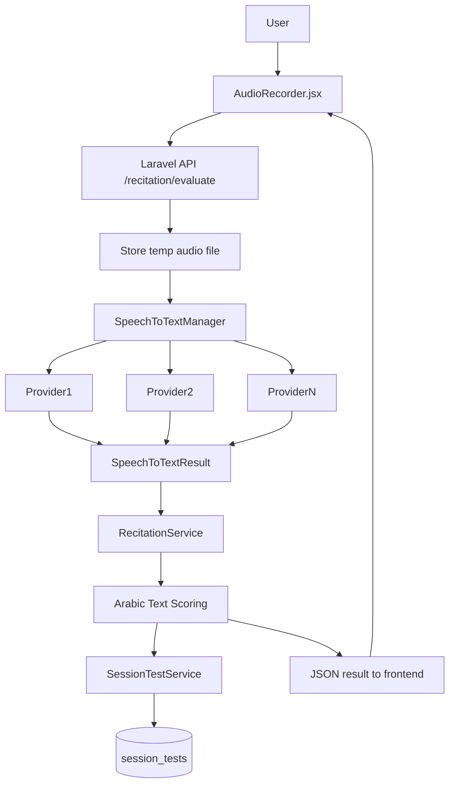

## هدف الخطة

تحويل التسميع الصوتي من محاكاة بسيطة إلى نظام حقيقي يعتمد على خدمات تعرّف صوتي (Speech-to-Text) عربية متعددة، مع طبقة تجريد تمنع الارتباط بمزوّد واحد، ونظام تقييم مرن يندمج مع جدول `session_tests` والواجهة الحالية (`AudioRecorder`, `TestManager`, صفحة `Memorize`).

## 1. تصميم معماري عام

- **طبقة التجريد STT**:
  - إنشاء واجهة خدمة عامة (مثلاً `App\Services\Recitation\SpeechToTextProviderInterface`) تُعرّف دوال مثل:
    - `transcribeAudio(string $filePath, string $language = 'ar', array $options = []): SpeechToTextResult`.
  - إنشاء كيان نتيجة موحَّد (DTO بسيط) مثلاً `SpeechToTextResult` يحتوي على:
    - النص المحوّل، الثقة الإجمالية، الثقة لكل مقطع إن كان متاحاً، البيانات الخام من المزود.
- **طبقة اختيار المزوّد Provider Manager**:
  - خدمة مثل `App\Services\Recitation\SpeechToTextManager` تقوم بـ:
    - قراءة الإعدادات من `config/recitation.php` أو جدول إعدادات (المزوّد الافتراضي، مزوّدات احتياطية).
    - محاولة الاتصال بالمزوّد الأساسي، وإذا فشل أو تجاوز مهلة معينة، تنتقل تلقائياً لمزوّد احتياطي.
    - توحيد الأخطاء وإرجاع Result/Exception مفهوم للتطبيق.
- **خدمة التسميع RecitationService**:
  - `App\Services\Recitation\RecitationService` تستخدم `SpeechToTextManager` + خوارزمية مقارنة نصوص عربية.
  - مسؤولة عن:
    - استلام ملف الصوت + نص الآيات المستهدفة.
    - تشغيل STT، ثم تمرير النص الناتج إلى طبقة تحليل/تطبيع عربية.
    - حساب درجة التطابق (Accuracy) وإرجاع تفاصيل قابلة للتخزين في `session_tests.details`.

## 2. اختيار مزوّدي الخدمات ودعم أكثر من مزوّد

- **مزوّدات مقترحة (قابلة للتعديل لاحقاً)**:
  - OpenAI Whisper API أو Whisper محلي (للدعم العام + مرونة اللغات).
  - Google Cloud Speech-to-Text (دعم عربي جيد ومجرَّب).
  - Azure Speech Service (خيار ثالث احتياطي).
- **طبقة إعدادات موحدة**:
  - إنشاء ملف إعدادات `config/recitation.php` يحتوي على:
    - `default_provider` (مثلاً `whisper`, `google`, `azure`).
    - مصفوفة `providers` تحتوي مفاتيح الاتصال لكل مزود (API keys, project id, region ...).
    - إعدادات عامة مثل: اللغة الافتراضية، مهلة الطلب، أقصى مدة للتسجيل، الخ.
- **استراتيجية تعدد المزودين**:
  - **Fallback**: إذا فشل المزوّد الأساسي (Timeout / خطأ)، ينتقل المدير للمزوّد التالي بالترتيب.
  - **Smart Routing (لاحقاً)**: يمكن مستقبلاً اختيار مزوّد معين بناءً على:
    - طول التسجيل.
    - نوع الجلسة (تسميع قصير مقابل سلسلة طويلة).
    - تكلفة كل مزوّد.

## 3. معالجة النص العربي والتقييم (Scoring)

- **تطبيع النص العربي** (Normalization):
  - بناء خدمة `ArabicTextNormalizer` تقوم بـ:
    - إزالة التشكيل.
    - توحيد الألف (ا، أ، إ، آ → ا)، الياء/الألف المقصورة، الهاء/التاء المربوطة حسب ما يلزم.
    - إزالة علامات الوقف، الرموز، الفراغات المكررة.
    - اختيارياً: تجاهل الكلمات الحشو الشائعة إذا لزم.
- **تقسيم الآيات إلى وحدات مقارنة**:
  - إعداد الدالة لتجميع نص الآيات المستهدفة (من `verses` التي يتم تلاوتها ضمن `planItem`).
  - دمجها في نص واحد أو قائمة جمل للمقارنة مقابل نص STT.
- **خوارزميات التقييم**:
  - خطوة أولى: **Levenshtein / edit distance** أو **WER (Word Error Rate)** بعد التطبيع.
  - احتساب درجات فرعية:
    - نسبة الكلمات الصحيحة.
    - نسبة الكلمات الزائدة/الناقصة.
  - تحويل النتيجة إلى نسبة مئوية `accuracy`، وتحديد `passed` بناءً على `minimum_test_score` في `UserPreference`.
- **مخرجات التقييم**:
  - هيكل JSON لتخزينه في `session_tests.details` يشمل:
    - النص الأصلي المستهدف.
    - النص الناتج من STT.
    - النصين بعد التطبيع.
    - قائمة اختلافات (diff) إن أمكن.
    - اسم المزوّد المستخدم وزمن الاستجابة.

## 4. توسيع الباكند (Laravel)

- **خدمات جديدة**:
  - `App\Services\Recitation\SpeechToTextProviderInterface` + Implementations لكل مزوّد:
    - `WhisperSpeechToTextProvider`.
    - `GoogleSpeechToTextProvider`.
    - `AzureSpeechToTextProvider`.
  - `App\Services\Recitation\SpeechToTextManager`:
    - يحمّل إعدادات المزوّدين.
    - يختار المزوّد، يتعامل مع الأخطاء ووقت الانتظار.
  - `App\Services\Recitation\RecitationService`:
    - دالة `evaluateRecitation(User $user, PlanItem $planItem, string $audioPath): RecitationResultDTO`.
- **تكامل مع SessionTestService**:
  - بعد حساب النتيجة، استدعاء:
    - `SessionTestService::storeTestResult($userId, $planItemId, SessionTest::TYPE_RECITATION, $score, $details);`
  - الحفاظ على منطق `canMarkAsCompleted` الحالي بدون تغيير (فقط نستخدم النتيجة الفعلية بدلاً من المحاكاة).
- **نقطة نهاية (API Endpoint)**:
  - إضافة مسار مثل: `POST /app/session/{planItem}/recitation/evaluate`.
  - المتحكم (مثلاً داخل `SessionController` أو `RecitationController` جديد):
    - يتحقق من صلاحيات المستخدم وخططه.
    - يستقبل ملف الصوت (multipart/form-data)، يخزنه مؤقتاً في storage.
    - يستدعي `RecitationService`.
    - يحفظ نتيجة الاختبار في `session_tests`.
    - يعيد للفرونت ردّ JSON بالنتيجة (accuracy, passed, messages).

## 5. تحديث الفرونت (React/Inertia)

- **تطوير `AudioRecorder.jsx`**:
  - بدلاً من توليد نتيجة عشوائية:
    - بعد إيقاف التسجيل، يتم إرسال Blob الصوت إلى الـ API الجديد باستخدام `FormData`.
    - التعامل مع حالة:
      - `loading` أثناء رفع/تحليل الصوت.
      - `error` عند فشل الاتصال أو التقييم.
      - عرض النتيجة القادمة من الباكند (النسبة المئوية + ملاحظات بسيطة).
- **ربط `TestManager.jsx`**:
  - إبقاء منطق المراحل كما هو، لكن:
    - دالة `handleRecitationComplete` تستقبل نتيجة حقيقية من `AudioRecorder` (accuracy, passed, detailsId... إن لزم).
    - تمرير هذه النتيجة إلى `SessionTestService` عبر endpoint موجود أو endpoint خاص بالاختبارات المتعددة (كما نفّذنا سابقاً).
- **التجربة البصرية للمستخدم**:
  - توضيح أن التسميع الآن "مدعوم فعلياً" برسالة تعليمية أول مرة.
  - عرض تنبيه عند استخدام مزوّد احتياطي (اختياري) مثل: "تم استخدام مزوّد بديل للتسميع، النتيجة قد تكون أقل دقة قليلاً".

## 6. الأمان والخصوصية

- **إدارة مفاتيح الـ API**:
  - استخدام `.env` فقط، وعدم تخزين المفاتيح في الكود المصدر.
  - تحميل المفاتيح عبر `config/recitation.php` مع `env()`.
- **تخزين الملفات الصوتية**:
  - استخدام storage خاص (مثل `storage/app/recitations/tmp`).
  - حذف الملفات المؤقتة بعد إتمام عملية التقييم (job أو من داخل الخدمة).
- **البيانات الحساسة**:
  - الحذر من إرسال النص الكامل الناتج من STT إلى الواجهة إذا لم يكن لازماً.
  - إمكانية تقليل تفاصيل `details` المخزنة في قاعدة البيانات لتفادي أي مشاكل خصوصية.

## 7. الأداء والتكلفة

- **التحكم في طول التسجيل**:
  - وضع حد أقصى لمدة التسجيل من الفرونت (مثلاً 60–120 ثانية) لتقليل التكلفة ووقت الانتظار.
- **Queue / Jobs**:
  - خياران للتنفيذ:
    - **Sync (بسيط كبداية)**: الطلب ينتظر حتى ينتهي التحليل (مناسب للمقاطع القصيرة). 
    - **Async (لاحقاً)**: إرسال التسجيل إلى Job في Queue، ثم استخدام WebSockets/Notifications لتحديث النتيجة (أكثر تعقيداً).
- **مراقبة التكلفة**:
  - إضافة إعدادات لتفعيل/تعطيل مزوّدات معينة حسب التكلفة.
  - تسجيل اسم المزوّد المستخدم وزمن المعالجة في `details` لتحليل الاستخدام لاحقاً.

## 8. الاختبارات (Tests)

- **اختبارات وحدة للطبقات الأساسية**:
  - `ArabicTextNormalizerTest`: التحقق من التطبيع.
  - `RecitationServiceTest`: إعطاء نصوص ثابتة (بدون STT حقيقي) ومحاكاة ناتج STT للتأكد من حساب الدرجات.
  - `SpeechToTextManagerTest`: محاكاة فشل/نجاح المزودين والتأكد من آلية الـ fallback.
- **اختبارات تكامل بسيطة**:
  - طلب API بـ ملف صوت تجريبي (ملف ثابت) مرتبط بآيات معروفة.
  - التأكد من إنشاء سجل في `session_tests` بالقيم الصحيحة.

## 9. خطة مراحل التنفيذ (Incremental)

- **المرحلة 1: البنية الأساسية بدون اتصال حقيقي**
  - إنشاء واجهات الخدمات والـ DTO وخدمة `RecitationService` مع منطق التطبيع والتقييم، باستخدام STT وهمي (Mock) داخل الباكند.
  - ربطها بالـ API والفرونت بدلاً من المحاكاة الحالية داخل React.
- **المرحلة 2: ربط مزوّد واحد حقيقي**
  - تطبيق `WhisperSpeechToTextProvider` أو Google كمزوّد أول.
  - ضبط مفاتيح الاختبار في `.env` وتجربة حقيقية على بيئة تطوير.
- **المرحلة 3: إضافة مزوّدات أخرى وطبقة Fallback**
  - إضافة مزوّدات إضافية وتفعيل منطق الاختيار/البديل في `SpeechToTextManager`.
- **المرحلة 4: تحسين التجربة والتكلفة**
  - تحسين رسائل الخطأ، سرعات الاستجابة، إدارة الملفات المؤقتة، وضبط حدود المدة.

## 10. نقاط تحتاج قراراً منك لاحقاً (لكن لا تعطل التنفيذ)

- اختيار المزوّد الأول الذي تفضّله كبداية (Whisper vs Google vs Azure).
- الحد الأقصى لمدة تسجيل التسميع (للدقيقة الواحدة، دقيقتين، أكثر...).
- مستوى التفاصيل التي ترغب في عرضها للمستخدم في النتيجة (مجرد نسبة مئوية أم توضيح مواضع الخطأ).